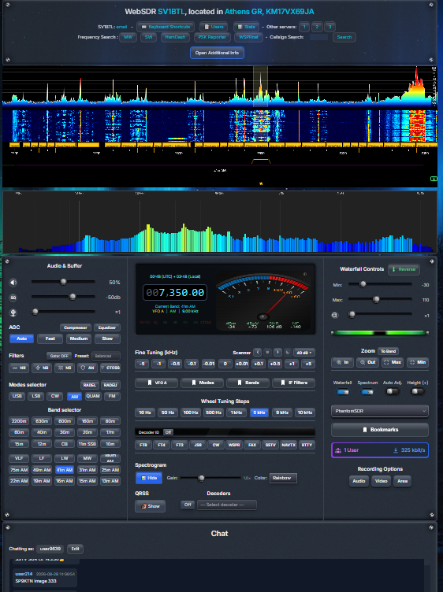
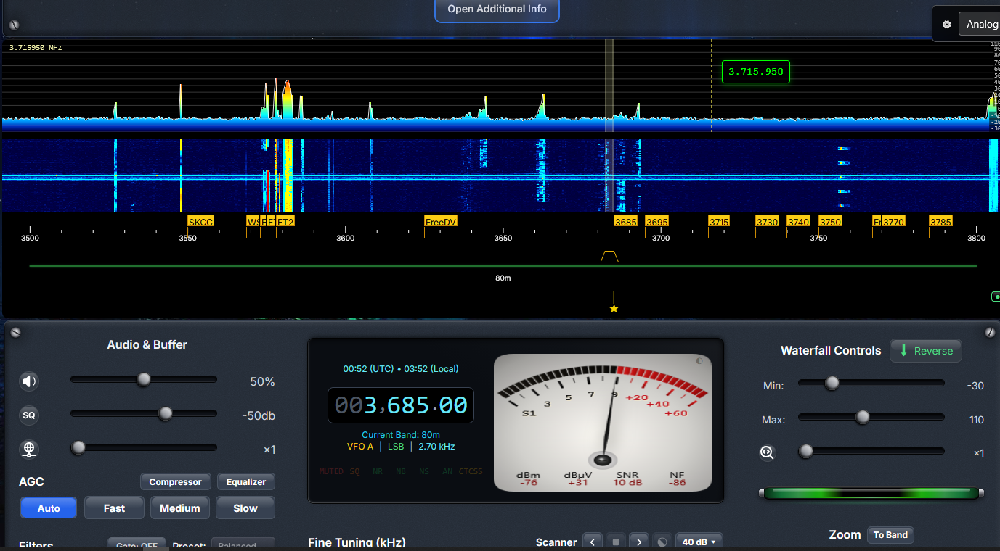
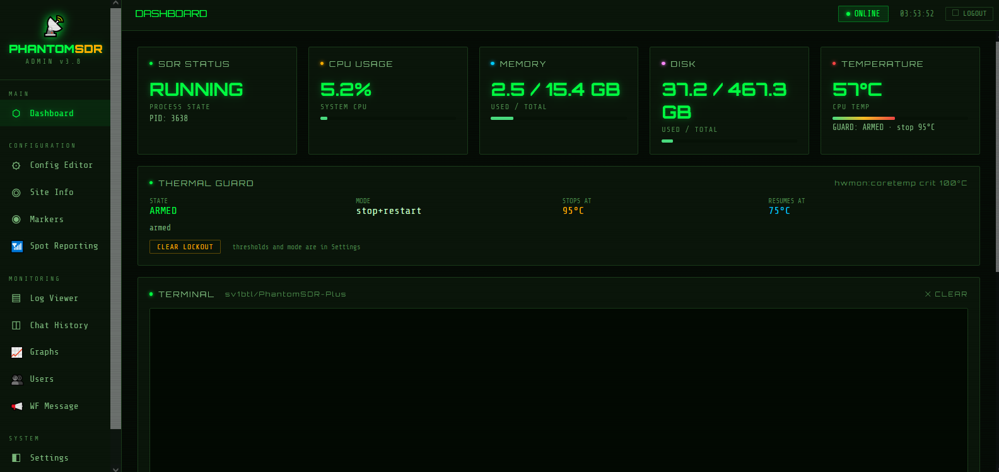

# PhantomSDR-Plus WebSDR (version 4.2.0)

[](https://www.gnu.org/licenses/gpl-3.0)
[](https://github.com/sv1btl/PhantomSDR-Plus)

**Maintained by SV1BTL.** The current version is 4.2.0, and the project lives at
**https://github.com/sv1btl/PhantomSDR-Plus** — that is the one to clone, link to
and report issues against.

## Note: Tested on Debian 12 (Bookworm), Debian 13 (Trixie), Ubuntu 22.04, Ubuntu 24.04.

**New in v.4.2.0**

* **AI noise reduction.** A new **AI** button with a strength slider sits under SQ in the Audio & Buffer panel (on the /mobile page, in the Audio tab under Squelch). It removes band noise from speech with RNNoise, a small neural network trained on voice — in the same spirit as RM Noise, but everything runs inside the listener's own browser: nothing is sent to an outside server, there is no account, and the receiver's CPU load does not change. The slider sets how strongly it works while someone is talking (default 50%); between words it works harder on its own. On a noisy SSB band the hiss between words drops by about 10 dB at 50% and by 20 dB or more at 100%, while the speech keeps its level, and the leftover hiss stays smooth; on weak stations the filter smooths its decisions more on its own. Voice modes only (USB, LSB, AM, SAM): in CW, FM, data modes and C-QUAM it steps aside, because the network treats a CW tone as noise. The decoders always get the audio from before it. See **[docs/USER_GUIDE.md](docs/USER_GUIDE.md)** under *AI Noise Reduction*.
* **The QRG Sync button is now labelled TCI-CAT**, after the protocol it speaks; it works as before. See [docs/RIG_CONTROL.md](docs/RIG_CONTROL.md#tci-cat-on-the-receiver-page).
* **Four more receivers set up by the installer, on every supported Linux.** The receiver question in `install.sh` (Debian and Ubuntu) and in `install_fedora.sh`, `install_arch.sh` and `install_opensuse.sh` now installs the complete driver chain for the **SDRplay RSP1A** (option 3, the open-source libmirisdr-5 driver with SoapyMiri), the **RigExpert Fobos SDR** (option 5, new, with two launchers: `start-fobos-hf.sh` for HF1/HF2 direct sampling 0-25 MHz and `start-fobos.sh` for the RF path) and the **Airspy HF+** (option 6, new): SoapySDR, the driver, `rx_sdr` and a udev rule, so the start script runs without `sudo`. The **HackRF One** (option 7, new, with `start-hackrf.sh`) needs only the distribution's `hackrf` package and a udev rule; its example config now reads the HackRF's samples as signed (`s8`), as they are. Each receiver's part is also a script of its own — `setup-rsp1a.sh`, `setup-fobos.sh`, `setup-airspyhf.sh`, `setup-hackrf.sh` — that adds a receiver to a station already installed. `start-rsp1a.sh` keeps using SDRplay's own API where that is installed, so existing RSP1A stations carry on unchanged. Details in [docs/INSTALLATION.md](docs/INSTALLATION.md#receivers-on-soapysdr-rsp1a-fobos-airspy-hf).

------------------

We also provide a wide range of additional **features**:

* A new `install.sh` installation procedure that simplifies the initial server setup.
* A `recompile.sh` script for quickly rebuilding the backend, the frontend, or both.
* An `update.sh` tool that updates the receiver with one command, keeping your configs, markers, logs and edited scripts untouched.
* Installers that stop a running receiver first, frame every step with its own verdict, and spell out the default of each question.
* A **Thermal Protection** function in Admin Panel, to avoid thermal stress of the CPU and take the proper actions.
* A modern, futuristic user-interface design.
* **CATsync** support through the [CATsync Tool for WebSDRs](https://catsyncsdr.wordpress.com/) application, **TCI-CAT** on the receiver page itself (ExpertSDR, AetherSDR, Thetis, or any Hamlib rig through the included bridge), and two-way rig control — frequency, mode and filter — in [Desktop PhantomSDR+](https://www.dropbox.com/scl/fo/kjwj96zg3kj7dgq4fjef9/APnA3c9hhv4hk3YMGIGjH7s?rlkey=jfiwklly63kv73poalx631pk3&st=m37uvaym&dl=0). See [docs/RIG_CONTROL.md](docs/RIG_CONTROL.md).
* **KiwiSDR client emulation** — an optional bridge that lets Kiwi clients such as **AetherSDR** and `kiwiclient` connect to the receiver directly, on the same host and port, with real retuning, waterfall and S-meter. Off until `[kiwi_emulation] enabled = true` is added to your config. See [docs/Aether_config.md](docs/Aether_config.md).
* **Receive diversity** — pair the receiver with a second site (another PhantomSDR-Plus, a KiwiSDR, an UberSDR or a WebSDR) and hear whichever of the two currently has the better signal. It runs in the listener's browser; only a WebSDR as the partner needs a small relay on your own server. See [docs/RECEIVE_DIVERSITY.md](docs/RECEIVE_DIVERSITY.md).
* A full-featured, password-protected Admin Panel for remote server management without requiring direct SSH access. It provides access to server logs, chat moderation, user messaging, chat-message deletion without restarting the server, user disconnection, command execution, file editing, and other administrative functions.
* Integrated decoders for **FT8, FT4, FT2, JS8, CW, QRSS Grabber, WSPR, HF FAX, SSTV, NAVTEX, FSK/RTTY, PSK31, Olivia, and FreeDV RADE V1**. See the [decoder documentation](docs/DECODERS.md).
* A **channel scanner** on the tuning row: it sweeps the band — or exactly what the waterfall is showing — and stops on the first channel rising a chosen number of dB above the band noise floor, resumes by itself when the channel goes quiet, keeps the step on the mode's own channel grid, and can skip empty channels by reading the spectrum. Locked-out channels and settings live in the listener's browser.
* A **Decoder ID** tool that identifies an unknown digital signal and offers the matching decoder in one click. Off by default.
* Picking a digital mode sets both the sideband and the passband.
* JS8 is shown as a conversation panel, with multi-frame messages reassembled.
* Integrated **C-QUAM AM Stereo** decoding. C-QUAM audio uses Opus compression by default, while the remaining audio modes use FLAC.
* All decoders have been moved off the main browser thread. Each decoder now runs in its own Web Worker, preventing signal decoding from competing with audio playback and GUI processing.
* Automatic spot reporting to **PSK Reporter** and **WSPRnet**. A built-in autorun engine locally decodes off-air signals and uploads reception reports without requiring additional software:
  * **FT8, FT4 and JS8 → [PSK Reporter](https://pskreporter.info/)** using the native IPFIX/UDP protocol. Spots are batched and transmitted at the recommended interval of at least five minutes. JS8 is spotted at Normal speed, from heartbeats, compound frames and directed messages; group destinations such as `@ALLCALL` and unresolved callsigns are never reported.
  * **WSPR → [WSPRnet](https://wsprnet.org/)** using the standard WSPRnet upload endpoint. WSPR reports are sent only to WSPRnet to prevent duplicate submissions.
* Integrated **FreeDV Reporter and DX Cluster tools**.
* **Automatic C-QUAM status indication**. When a C-QUAM transmission is detected, the button label turns green. While operating in AM mode, pressing the button again enables synchronous AM detection on the carrier. The label then turns yellow and displays `SAM`. Pressing the button once more returns the receiver to standard AM mode.
* A configurable band-plan overlay on the waterfall, with independent brightness, frequency-range, and visibility settings for each band.
* An improved custom colour-map system. A reversed spectrum and waterfall layout is used by default across all interface variants, although this behaviour can be changed manually.
* Optimized FLAC and Opus encoders with balanced latency. Both operate at 16-bit resolution, providing a theoretical dynamic range of approximately 96 dB. ⭐
* Numerous redesigned and optimized functions, including:
  * Reduced end-to-end latency.
  * Noise Reduction (spectral, tone-preserving).
  * Noise Cancellation.
  * Noise Blanker (impulse).
  * Background Noise Suppression.
  * Auto Notch for heterodynes and carriers.
  * AI Noise Reduction (RNNoise, in the listener's browser, voice modes only).
  * All of the above bypass the decoders, which read raw audio.
  * Synchronous AM enabled by default.
  * Selectable AGC modes.
  * Automatic squelch.
  * Configurable buffer settings.
  * Automatic waterfall-level adjustment.
  * Mouse-wheel frequency tuning.
  * Keyboard shortcuts.
  * Zoom slider.
  * Enhanced mobile GUI.
  * Selectable Noise Gate with presets.
  * Precise mouse-based tuning with a frequency readout directly on the waterfall.
* Integrated audio Compressor and Equalizer, with manual configuration and reset controls.
* Redesigned bookmarks with on-screen labels and import/export functionality.
* Four selectable GUI templates, accessible through a floating pop-up menu.
* Support for running the GUI through `localhost`.
* An optional monitoring tool that adds real-time server-status information to the PhantomSDR application.
* An on-screen real-time audio spectrogram.
* A “Magic Eye” signal-strength indicator that emulates the behaviour of EM84 tuning-indicator tubes used in vintage radio receivers.
* Audio recording and combined video/audio recording of either the complete waterfall or a user-selected region.
* A real-time connected-user list with geolocation data, map integration, and user statistics covering configurable time periods. Your own session is marked **you** in the list, whether it is opened from the interface or as a standalone `users.html` page.
* Improved server stability and fault reporting. If `spectrumserver` crashes or malfunctions, diagnostic information is written to `crash.log`.
* The `crash.log` file can be accessed both from the server’s root directory and through the Admin Panel.
* An optimized mobile GUI.
* Client-side CPU and memory usage have been reduced as much as possible.
* **Connection limits, and a flood guard.** The receiver can now cap simultaneous listeners and the rate of new connections per address, and bound the silent half-open connections that no other limit can see. Two keys switch it on — `per_ip` and `per_ip_rate` in `[limits]` — and everything defaults to off, so an existing config behaves as before. A refused listener is told why instead of watching a page that never loads. Below it sits `setup-firewall.sh`, an optional nftables layer that sheds volume before the server reads a byte and cannot lock you out of your own machine. Full manual, in all seven languages and in the offline PDFs: **[docs/CONNECTION_LIMITS.md](docs/CONNECTION_LIMITS.md)** — including how to measure your own traffic before choosing the numbers. **A dropped connection now ends the session.** The audio socket no longer reconnects by itself. On a receiver that was wrong: the waterfall and events sockets never came back with it, so a retried session was live audio attached to a frozen waterfall, and stopping the server stopped clearing it.
* **TCI-CAT on the receiver page.** A new **TCI-CAT** button beside IF Filters lets the page follow your own transceiver by itself, with no desktop application: the browser talks straight to the TCI server of ExpertSDR, AetherSDR or Thetis on your computer. Frequency, mode and filter width follow in both directions — turn the rig's dial or press its FIL button and the receiver follows, click the waterfall or pick an IF filter and the rig follows — and the page falls silent while you transmit. 
* **Transceiver control from the desktop app.** [Desktop PhantomSDR+](https://www.dropbox.com/scl/fo/kjwj96zg3kj7dgq4fjef9/APnA3c9hhv4hk3YMGIGjH7s?rlkey=jfiwklly63kv73poalx631pk3&st=m37uvaym&dl=0). **A 💾 Desktop applications button** under Open Additional Info, beside System Resources, opens the download folder of Desktop PhantomSDR+. 
* PhantomSDR is registered with the following WebSDR directories:
  * [sdr-list.xyz](https://sdr-list.xyz)
  * [sdr.shbrg.nl](https://sdr.shbrg.nl/sdr/)
  * [websdr.org](http://websdr.org/)
* Supported receivers currently include the **RX-888, RTL-SDR Blog V4, Airspy HF+ Discovery, HackRF, SDRplay RSP1A and RigExpert Fobos SDR**, including compatible clones through SoapySDR. Support for additional receivers is planned.

- More to come!...

> [!NOTE]
> **🎯  You can find Older Repositories here**: https://github.com/sv1btl/PhantomSDR-Plus_Archive

## Features
- WebSDR which can handle multiple hundreds of users depending on the Hardware.
- Common demodulation modes.
- Can handle high sample rate SDRs (70MSPS real, 35MSPS IQ).
- Support for both IQ and real data.
- Full decoder support.
- Lightweight mobile view at **/mobile** for phones on limited data plans.

## Benchmarks
- Ryzen 5* 2600 - All Cores - RX888 MKii with 64MHZ Sample Rate, 32MHZ IQ takes up 38-40% - per User it takes about nothing, 50 Users don't even take 1% of the CPU.
- RX 580 - RX888 MKII with 64MHZ Sample Rate, 32MHZ IQ takes up 28-35% - same as the Ryzen per User it takes about nothing (should handle many).
- Intel i5-6500T - RX888 MKII - 60MHz Sample Rate, 30MHz IQ, OpenCL installed and enabled, about 10-12%. 100 users is no problem with OpenCL as the GPU does the heavy lifting.

## Screenshots

The SV1BTL WebSDR: http://phantomsdr.no-ip.org:8900/

  

(https://sdr-list.xyz)

## Installation

Everything is installed by one script. Nothing has to be prepared by hand first — no dependency list to paste, no Node.js to fetch, no OpenCL packages to hunt down.

```
git clone --recursive https://github.com/sv1btl/PhantomSDR-Plus
cd PhantomSDR-Plus
chmod +x *.sh
./install.sh
```

**Restart your terminal after the installer finishes**, otherwise the newly installed Node.js and Rust are not yet on your `PATH`.

> **Already running PhantomSDR-Plus? Do not install it again.** The installer is for a machine that has none. To bring an existing receiver up to date, fetch the updater once and let it do the work — your `.toml` configuration, markers, admin password, frequency list and chat history are never touched, and anything you edited yourself is put to you rather than overwritten: <br />
> ```
> cd ~/PhantomSDR-Plus
> curl -fLO https://raw.githubusercontent.com/sv1btl/PhantomSDR-Plus/main/update.sh
> chmod +x update.sh
> ./update.sh
> ```
> That last line only *reports* what would change and writes nothing; `./update.sh --apply` does it. Full details in **[The update tool](#the-update-tool)**. Re-running `install.sh` over a working site is only needed when a rebuild fails because system packages are missing.

Pick the installer that matches your system. They do the same work and ask the same questions; only the package manager differs:

| System | Script |
|---|---|
| Ubuntu 22.04 / 24.04 / 26.04, Debian 12 / 13 | `./install.sh` |
| Fedora | `./install_fedora.sh` |
| Arch | `./install_arch.sh` |
| openSUSE Tumbleweed | `./install_opensuse.sh` |

> **One installer for every Debian and Ubuntu release.** `install.sh` reads `/etc/os-release` and the installed Boost version and adapts itself; the old `install_ubuntu22.sh`, `install-Deb12.sh` and `install_ubuntu26.sh` are gone. It sets `DEBIAN_FRONTEND=noninteractive`, so the `tzdata` that arrives with `python3-matplotlib` cannot stop the run to ask for your time zone and then swallow the answer meant for the next question. On Jammy it calls `install_rade_ubuntu22.sh` directly, because Jammy's `python3-websockets` is 10.1 and RADE needs 11.0 or newer. It knows where `intel-opencl-icd` lives on each release: in the repositories on 22.04 and 26.04, in `non-free` on Debian 12, and in Intel's own graphics repository on 24.04 and Debian 13. And where Boost is 1.87 or newer, the websocketpp header patch stops being optional — the installer verifies it landed and refuses to build without it. No newer compiler is ever needed: the stock GCC accepts `-std=c++23` on all five releases, so do not install `gcc-12` for this.

The installation runs in 17 clearly numbered steps, and every point where it waits for you is fenced by a **⌨️  YOUR INPUT IS NEEDED** banner, so a question cannot be mistaken for progress output scrolling past. The seven questions are listed up front, before anything is installed. Setting `PHANTOM_NONINTERACTIVE=1` answers all of them with their defaults; see the header of `install.sh` for the `PHANTOM_*` overrides.

**Every run writes `install.txt`.** When the installer finishes — or dies halfway — it writes a report to `install.txt` in the PhantomSDR-Plus directory: the result, each of the 17 steps as OK / SKIPPED / PARTIAL / FAILED, what it detected (distribution, Boost, compiler, Node.js), which components were installed, and every warning that came up. A run that fails leaves a report ending at the step that failed, with the reason and a note that the installer is safe to re-run. It is the first file to read when something did not work, and the first to attach to a bug report. Each run overwrites it, so keep a copy if you want to compare two installations.

> **Ubuntu 26.04, Arch and openSUSE Tumbleweed build, but have not been run on air.** All three ship a Boost newer than 1.87, which removed the `io_service` API that the vendored websocketpp 0.8.2 was written against. The patched headers the installer copies in bridge that gap (`io_context`, `executor_work_guard`, `boost::asio::post`, the modern resolver), and where Boost is 1.87 or newer the installer treats that patch as mandatory rather than optional — it verifies the copies landed and refuses to build without them. A complete install, receiver driver and all optional components included, has been verified end to end in containers on Boost 1.90 (Ubuntu 26.04), 1.91 (openSUSE Tumbleweed) and 1.92 (Arch). That proves the server compiles and starts — not that it serves a receiver for hours. Treat all three as untested in production until someone reports back.

> **openSUSE means Tumbleweed.** That is where `install_opensuse.sh` is verified. Leap 15.6 does not work: its repositories carry no `liquid-dsp-devel` at all, which the backend needs, and Boost is only available under versioned package names. Supporting Leap would mean adding third-party OBS repositories, so it is out of scope for now.

### What the installer does — read this before you start

It runs as 18 numbered steps and stops to ask you eight questions, each fenced by a "YOUR INPUT IS NEEDED" banner — so either stay at the keyboard, or set `PHANTOM_NONINTERACTIVE=1` and let it answer everything with its defaults. Depending on your machine and on how many extras you keep, expect anywhere from about twenty minutes to well over an hour — the torch download and the radae build are the long parts. In order, the script:

1. **Stops a running PhantomSDR-Plus first.** It lists what is live on the machine — the admin panel, the reverse proxy, the statistics server and the receiver itself — and offers to stop it, defaulting to yes; whatever it stopped, it starts again as its last action. Answer `n` and it prints the commands and waits while you stop them yourself, in which case it leaves them alone at the end. Installing on top of a live receiver overwrites a binary that is still running and lets the watchdog restart the half-written copy mid-compile, which then reads as a broken build. Only a running start script counts as the receiver; one that is merely open in an editor is left alone.
2. **Detects your distribution** and installs every build dependency with your own package manager: compiler and build tools, meson/ninja, FFTW, Boost, FLAC, Opus, liquid-dsp, zlib/zstd, libcurl and the rest.
3. **Installs Node.js 22 through nvm** if the system does not already have it, or has a version that is too old.
4. **Builds the backend** with meson.
5. **Sets up your receiver.** It asks which SDR you have — RX888 MkII / RX888, RTL-SDR (with a separate question for the Blog V4), SDRplay RSP1A, RigExpert Fobos SDR, Airspy HF+, HackRF One, or none — and builds the driver for it. The RSP1A, Fobos and Airspy HF+ run through SoapySDR and `rx_sdr`; for them it runs `setup-rsp1a.sh`, `setup-fobos.sh` or `setup-airspyhf.sh`, which also install a udev rule. For the HackRF One it runs `setup-hackrf.sh`, which installs the distribution's `hackrf` package and a udev rule. Choosing the **RX888 also installs the udev rules** for you (`setup-rx888-udev.sh`), so `rx888_stream` and the start scripts never need `sudo` to open the device. You have to log out and back in once for that to take effect.
6. **Opens `frontend/site_information.json` in your editor** so you can fill in your callsign, locator, hardware and antenna. **Do not skip this** — it is what your visitors see. The fields are explained further down this page.
7. **Installs the frontend dependencies and builds the pages**, desktop and `/mobile`.
8. **Installs OpenCL.** It first looks at what the machine actually has — an Intel, AMD or NVIDIA GPU, or an x86 CPU runtime — and then picks the provider that suits your distribution on its own, with no menu to answer. If there is no OpenCL-capable device it tells you so plainly and carries on; the server runs perfectly well on FFTW, just leave `accelerator="none"` in your `.toml`.
9. **Offers the three extras, all of which are installed by default.** Answer `n` to any you do not want:
   * the **admin panel** (`setup_admin.sh`) — dashboard, log viewer, config editor,
     connected users with a kick button, chat moderation and the thermal guard,
   * the **FreeDV RADE V1 decoder** (`install_rade.sh`) — builds radae and starts the
     sidecar; it works on apt, pacman, dnf and zypper systems,
   * the **statistics server** (`install-stats-server.sh`) — the CPU, RAM and
     temperature feed shown on the receiver page.
10. **Re-applies the five patched websocketpp headers** over the meson subproject and verifies they landed. `request.hpp` (the fix websdr.org registration needs) and `connection_impl.hpp` are the project's own changes; the three `websocketpp_asio*.hpp` files are the Boost ≥ 1.87 compatibility work, without which the backend cannot compile against Boost 1.90 at all. All of it used to be a manual step; it is not any more, and where Boost is 1.87 or newer the installer treats a missing or reverted patch as a hard failure rather than a warning.
11. **Runs `recompile.sh` as its very last action**, so the backend is built from the
    patched headers and the frontend from whatever the extras added. Answer
    `[3] Both backend and frontend`, choose the S-meter/layout variant a first-time
    visitor should see, then `[1] build-all.sh`.

Each extra is a normal script you can also run on its own at any time — `./setup_admin.sh`, `./install_rade.sh`, `./install-stats-server.sh`, `./setup-rx888-udev.sh`, and for the receivers `./setup-rsp1a.sh`, `./setup-fobos.sh`, `./setup-airspyhf.sh` and `./setup-hackrf.sh` — they are exactly what the installer calls.

> [!NOTE]
>
> **🎯 Registering on the websdr.org map**
>
> The header patch that registration depends on is applied by the installer, so all that is left is your `.toml` — prepare it as described in the section "The .toml file":
>
> [websdr.org] <br />
> enabled     = true # or false <br />
> public_host = "your_ip_address" <br />
> public_port = PORT <br />
> qth         = "QTH_Locator" <br />
> description = "CALLSIGN PhantomSDR+" <br />
> email       = "mail@domain.com" <br />
> logo        = "logo.jpg" <br />
>
> If you change the `.toml` after the installation, only a backend rebuild is needed:
> ```
> cd PhantomSDR-Plus/ ./recompile.sh
> ```


## Examples
Remember to set the frequency and sample rate correctly in the start script for your receiver (e.g. `start-rtl.sh`). In each start script these live in the **RECEIVER CONFIGURATION** block near the top — edit the `RX_ARGS` line (for `start-rx888mk2.sh` it is `RX888_ARGS`). The command examples below show what those arguments become. <br />
You also need to modify the .toml file, e.g. config-rtl.toml

### RTL-SDR
```
rtl_sdr -f 145000000 -s 2048000 - | ./build/spectrumserver --config config.toml
```
**in .toml** <br />
sps=2048000 # RTLSDR Input Sample Rate for 144-146 MHz receiving <br />
frequency=145000000 # Baseband frequency <br />

frequency=145000000 # Default frequency to show user <br />
modulation="FM" # Default modulation <br />

**and in sites-information** <br />
"siteSDRBaseFrequency": 145000000,<br />
"siteSDRBandwidth": 2048000,

### HackRF (10 Msps, WBFM; format: s8)
```
hackrf_transfer -r - -f 100900000 -s 10000000 | ./build/spectrumserver --config config.toml
```
### Airspy HF+ (912 ksps, AM; format: s16)
```
rx_sdr -d driver=airspyhf -f 648000 -s 912000 -F CS16 - | ./build/spectrumserver --config config.toml
```
### SDRplay RSP1A (8 Msps, LSB; format: s16)
```
rx_sdr -d driver=soapyMiri -t flavour=SDRplay -f 7100000 -s 8000000 -F CS16 - | ./build/spectrumserver --config config.toml
```
With SDRplay's own API installed instead, the driver is `-d driver=sdrplay`.
### RigExpert Fobos SDR, HF1/HF2 (direct sampling 0-25 MHz, 50 Msps; format: s16, signal=real)
```
rx_sdr -d driver=fobos -t direct_samp=1 -f 0 -s 50000000 -I CF32 -F CF32 - | ./cf32_to_real | ./build/spectrumserver --config config.toml
```
### RX888 MK2 (real sampling 6 Msps; format: s16, signal=real)
```
rx888_stream -s 6000000 | ./build/spectrumserver --config config.toml
```

## Start files and configs added for various receivers
The SDRplay RSP1A, the RigExpert Fobos SDR and the Airspy HF+ need SoapySDR and rx_tools, otherwise they will not work. The HackRF One needs only the distribution's `hackrf` package. The installer sets all of it up for the receiver you select in its SDR question, and `setup-rsp1a.sh`, `setup-fobos.sh`, `setup-airspyhf.sh` and `setup-hackrf.sh` do the same on an installed station; for anything they do not cover, install that driver yourself before using its start script.<br />
`psutils` is installed for you as well, as it is needed for the killall command.<br />
If the installer reported that OpenCL could not be installed on your machine, keep `accelerator="none"` in your `.toml`.

### Self-contained launcher + watchdog
Each start script — `start-rx888mk2.sh`, `start-airspyhf.sh`, `start-rtl.sh`, `start-rsp1a.sh`, `start-fobos-hf.sh`, `start-fobos.sh`, `start-hackrf.sh` — is a **single self-contained script that starts, restarts, watchdogs and logs** the server, and that also brings up the **RADE sidecar** and reports your **directory registration** status. You only ever need that one start script plus the shared `stop-websdr.sh`; there is no separate check, restart, kill or RADE file to run.

```bash
./start-rtl.sh        # start (or cleanly restart), showing progress in the terminal
./start-rtl.sh -q     # same, but quiet: two lines instead of the live log
./stop-websdr.sh      # stop the server, its watchdog and RADE (works for ANY receiver)
```

What running a start script does:
- Stops any instance already running, then launches the receiver → `spectrumserver` chain and **detaches** (via `setsid`) so it keeps running after you close the terminal.
- **Shows you what is happening.** The watchdog has to be detached from your terminal, so it writes to the log; the launcher mirrors that log to the screen while the server comes up, then prints a summary and returns you to the prompt. Pressing `Ctrl-C` during the mirror stops only the mirroring — the server and watchdog keep running.
- Runs a **watchdog** that auto-restarts the chain in place if the receiver or `spectrumserver` dies — no external cron/systemd needed.
- Starts the **RADE sidecar** (`rade_helper.py`) once the receiver and `spectrumserver` are both confirmed up, and restarts it on its own if it later exits — without restarting the server with it. If RADE is not installed the server starts normally and the summary simply notes that the sidecar was not activated.
- Reports whether **[websdr.org] enabled** and **[websdr] register_online** are turned on in your `.toml`, and waits for websdr.org to answer so you can see the registration actually succeed rather than guessing.
- Writes human-readable progress to **`logwebsdr.txt`** (`tail -f logwebsdr.txt` to watch), and `spectrumserver`'s own output to **`spectrumserver.log`**, which rotates at 10 MB. The `[WebSDROrg]` registration lines appear in both, minus the routine chatter, which is kept to `spectrumserver.log` alone so it cannot swamp `logwebsdr.txt`: the `/~~orgstatus` callback (every few seconds) and the 60-second keep-alive ping. What stays in `logwebsdr.txt` is the registration story — connect, first ping, acceptance, one confirmation after each later reconnect — plus every error, which is never filtered.
- Uses a **`flock` lock** so only one receiver/server runs at a time — starting a different receiver first stops the current one.

A successful start ends like this:

```
  ────────────────────────────────────────────────────────────
  ✔ server is up   (spectrumserver + rx888_stream running)
  ✔ RADE sidecar running
  ✔ websdr.org registered (your.host.example:8900)
  · SDR directory posting enabled (errors only, in spectrumserver.log)
  Full log: /path/to/PhantomSDR-Plus/logwebsdr.txt
```

A `·` line is information only, nothing is wrong; `!` means something that should be running is not, and `✖` means the server did not come up in the time allowed — in that last case the watchdog is still retrying, so check `logwebsdr.txt`.

The scripts are fully self-contained (they derive their own directory, no hard-coded paths). Useful overrides, all optional:
- `SPECTRUM_CORES=0-3 ./start-rtl.sh` — pin `spectrumserver` to specific CPU cores (`none` disables pinning; otherwise it auto-derives a sensible range from `nproc`).
- `RX_ARGS="…" ./start-rtl.sh` — override the receiver arguments without editing the file (`RX888_ARGS` for `start-rx888mk2.sh`).
- `RADE_ENABLED=0 ./start-rtl.sh` — start the server without the RADE sidecar.
- `RX_DRIVER=miri ./start-rsp1a.sh` (or `sdrplay`) — choose the RSP1A driver instead of letting the script pick: libmirisdr-5, or SDRplay's own API.


## During installation, the script will open the site_information.json file in your favourite editor for you to edit and save. Don't skip this step!

	"siteSysop": "your name or callsign",
	"siteSysopEmailAddress": "mail@mail.net",
	"siteGridSquare": "QTH locator",
	"siteCity": "City Country",
	"siteInformation": "https://github.com/sv1btl/PhantomSDR-Plus",
	"siteHardware": "Hardware you are using, ",
	"siteSoftware": "Software you are using",
	"siteReceiver": "Receiver model",
	"siteAntenna": "Receiving Antenna.",
	"siteNote": "This is a bright new open-source WebSDR project, under active development.",
	"siteIP": "http://Your site IP:port",
	"siteStats": "http://Your site IP:3001",
	"siteSDRBaseFrequency": 0,
	"siteSDRBandwidth": 30000000,
	"siteRegion": 1,
	"siteChatEnabled": true


Where: <br />

**"siteInformation"**: "https://github.com/sv1btl/PhantomSDR-Plus" — please don't change this. It points to the project's GitHub repository.<br />
**"siteIP": "http://Your site IP:port"** — e.g. http://mysite.com:9002 <br />
**"siteStats": "http://Your site IP:3001"** — e.g. http://mysite.com:3001, or any other port you chose during the monitor tool setup. <br />
**"siteSDRBandwidth"**: enter the usable bandwidth of your receiver — e.g. 2048000 for the RTL, or 60000000 or 1200000000 for the RX-888, etc.<br />

**"siteRegion"**: select your IARU region, where:<br />
1 is for Africa, Europe, the Middle East and northern Asia,<br />
2 is for the Americas — North, Central and South America, as well as the Caribbean — and<br />
3 is for Oceania, East Asia, Southeast Asia and the Pacific Islands.<br />

"siteChatEnabled": **true** determines whether the chat window is enabled.<br />


## The .toml file

You also need to edit these sections in the .toml file you use:

[server] port=PORT # Server port html_root="frontend/dist/" # HTML files to be hosted otherusers=1 # Send where other users are listening, 0 to disable threads=6

[websdr] register_online=true # Enable directory registration updates register_urls=[ "https://sdr-list.xyz/api/update_websdr", "https://sdr.shbrg.nl/api/update_websdr" ] # One or more directory endpoints that accept the same JSON payload name="CALSIGN CATsync PhantomSDR+" # Name that is shown on https://sdr-list.xyz and/or https://sdr.shbrg.nl/sdr/ antenna="WIRE" # Antenna that is shown on https://sdr-list.xyz grid_locator="QTH_LOCATOR" # 4- or 6-character grid locator, shown on https://sdr-list.xyz and used for the distance of FT8 signals hostname="your_IP" # If you use ddns or something to host with a domain enter it here for https://sdr-list.xyz

[server]<br />
port=9002 # Select your Server port<br />
html_root="frontend/dist/" # HTML files to be hosted<br />
otherusers=1 # Send where other users are listening, 0 to disable<br />
threads=2<br />

[websdr.org] enabled     = true # or false public_host = "your_ip_address" public_port = PORT qth         = "QTH_Locator" description = "CALLSIGN PhantomSDR+" email       = "mail@domain.com" logo        = "logo.jpg"

[websdr]<br />
register_online=true # or false. If the SDR should be registered on https://sdr-list.xyz then put it to true<br />
name="Name" # Name that is shown on https://sdr-list.xyz<br />
antenna="Whip" # Antenna that is shown on https://sdr-list.xyz<br />
grid_locator="QTH Locator" # 4- or 6-character grid locator, shown on https://sdr-list.xyz and used for the distance of FT8 signals<br />
hostname="your IP, or ddns, or no-ip" # If you host with a domain via ddns or similar, enter it here for https://sdr-list.xyz<br />

[input] # depends on the receiver you use. The following settings are for the RTL<br />
sps=1536000 # RTL Input Sample Rate. For RX888 sps will be 60000000 for 0-30 MHz receiving<br />
fft_size=131072 # For RTL. FFT bins alternative for RX888 are 1048576, 2097152, 4194304 (default for RX888), 8388608, 16777216, look at https://www.mymathtables.com/numbers/power-exponentiation/power-of-2.html<br />
brightness_offset=-10 # Waterfall brightness offset. Reduce to negative if you see black regions in the waterfall<br />
frequency=1242000 # Baseband frequency<br />
signal="iq" # real or iq (real for RX888)<br />
fft_threads=2<br />
accelerator="none" # Accelerator: none, cuda, opencl<br />
audio_sps=12000 # Audio Sample Rate. Keep it always to 12000 for FT8 and Opus<br />
audio_compression="flac" # flac or opus (default is flac)<br />
smeter_offset=-2<br />
waterfall_size=1024<br />
waterfall_compression="zstd"<br />

[input.driver]<br />
name="stdin" # Driver name<br />
format="u8" # Sample format: u8, s8, u16, s16, u32, s32, f32, f64 -> use s16 for RX888<br />

[input.defaults]<br />
frequency=7120000 # Default frequency to show user<br />
modulation="LSB" # Default modulation<br />


## The bands-config.js
This file is located in frontend/src/bands-config.js and defines the bands the SysOp creates. <br />
Your band plan is yours: **[The update tool](#the-update-tool)** never overwrites this file silently — it shows you the difference against the new version and lets you keep yours, take theirs, or keep both. <br />
- You will see something like the following, and you are free to edit it as you like:
   ```
   - const bands = 
   .....
   - { ITU: 1,
            name: '40m', min: -30, max: 110, initFreq: '7120000', publishBand: '1', startFreq: 7000000, endFreq: 7200000,  stepi: 1000, color: 'rgba(50, 168, 72, 0.6)', 
	    modes: [
              { mode: MODES.CW, startFreq: 7000000, endFreq: 7040000 },
              { mode: MODES.LSB, startFreq: 7040000, endFreq: 7200000 }]
	},
	{ ITU: 2,
            name: '40m', min: -30, max: 110, initFreq: '', publishBand: '1', startFreq: 7000000, endFreq: 7300000,  stepi: 1000, color: 'rgba(50, 168, 72, 0.6)', 
	    modes: [
              { mode: MODES.CW, startFreq: 7000000, endFreq: 7050000 },
              { mode: MODES.LSB, startFreq: 7050000, endFreq: 7300000 }]
	},
	{ ITU: 3,
            name: '40m', min: -30, max: 110, initFreq: '', publishBand: '1', startFreq: 7000000, endFreq: 7200000,  stepi: 1000, color: 'rgba(50, 168, 72, 0.6)',
            modes: [
              { mode: MODES.CW, startFreq: 7000000, endFreq: 7040000 },
              { mode: MODES.LSB, startFreq: 7040000, endFreq: 7200000 }]
   .....
   etc
   ```
   **Where:** <br />
   - **ITU** is the region in which the server is located,
   - **min & max** are the waterfall brightness limits for the given band,
   - **initFreq** is the initial frequency to tune to when the band is selected,
   - **publishBand** sets whether the band is shown: 1 for amateur bands, 2 for broadcast bands,
   - **startFreq & endFreq** define the band limits,
   - **stepi** is the default mouse-wheel step for the band, and **modes** is the preferred default mode for the band.

- After making changes, **run ./recompile.sh in a terminal** from the PhantomSDR-Plus folder.


## Background image

The image is located at PhantomSDR-Plus/frontend/src/assets/background.jpg<br />
Replace it with the image you prefer, but keep the same filename.


## The mobile view

When the server address is entered in a mobile browser, the **mobile interface** is selected automatically. This interface is specifically optimized for smartphone screens and provides almost all the functionality available in the desktop version within a compact layout.<br />

A **second, much lighter web interface for phones**, reachable at:
```
http://your_server:port/mobile
```
It is a separate page, not a re-layout of the main app, and it draws **no waterfall**. It opens only the audio connection, which is where the saving comes from: measured on a live receiver, the full interface streams about **68 MiB/hour** (audio + waterfall + events) against roughly **30 MiB/hour** for the mobile view — a little over **half the data**. The first page load is 105 KiB against 294 KiB. <br />

It contains: frequency entry and tuning steps, modes (including SAM and the RADE **RADEL/RADEU** decoders), a digital S-meter bar with the S1…+60 dB scale, volume / squelch / buffer controls, band buttons from `bands-config.js`, bookmarks, the connected-users list with a tune-to button, and chat. The layout adapts to both portrait and landscape. <br />

Two buttons at the bottom switch to the other interfaces: **Mobile extended view** (the main app's own mobile layout) and **Full desktop view** (the complete interface, forced on a phone). The main app's mobile layout in turn carries a **Simple mobile view** button back to `/mobile`. <br />

**The tuning follows you across the switch.** Each of those buttons carries the current frequency and mode in the link (`?frequency=<Hz>&modulation=<MODE>`), and both pages read it on load, so changing view keeps you on the same signal instead of dropping back to the receiver's default frequency. The address bar is kept up to date as you tune, which means reloading the page — or bookmarking it as it stands, or sending the link to someone — also returns to that frequency. The **mode follows `bands-config.js`**: an explicit mode travels with the link, but when the other view has no equivalent for it the band plan for the frequency you landed on decides — so a broadcast frequency arrives in AM, 40 m in LSB, a CW segment in CW, instead of falling back to a default. `SAM` on `/mobile` maps to AM with the synchronous detector in the extended view and back again. `RADEL`/`RADEU` are mobile-only: the frequency carries over and the band plan sets the mode. Out-of-range or malformed values are clamped to the receiver's coverage. <br />

Bookmarks are stored per device. To move them between a phone and a PC, use the Export / Import buttons in the Marks tab — they produce a QR code and a text block that can be pasted into the other browser. <br />

The page is built by **frontend/build-mobile.sh**, which `build-all.sh` also calls. It is self-contained in `dist/mobile/` with its own `assets/` folder, so that directory can be copied on its own. <br />

## The update tool
The **update.sh** script updates an installed receiver from the published tree at
**https://github.com/sv1btl/PhantomSDR-Plus**, without touching the files that make it *your* site. It lives in
the root folder and is run in a terminal: <br />
```
./update.sh                 tells you what WOULD change; writes nothing
./update.sh --apply         does it, asking about anything you have edited
./update.sh --restore LAST  puts back whatever the last run overwrote
```
**If your installation does not have `update.sh` yet**, an older tree will not contain the script — fetch it once, the only step of this procedure you ever do by hand: <br />
```
cd ~/PhantomSDR-Plus
curl -fLO https://raw.githubusercontent.com/sv1btl/PhantomSDR-Plus/main/update.sh
chmod +x update.sh
```
From then on everything, `update.sh` included, is brought in by the tool. <br />

Run without `--apply` it is completely safe — it downloads, compares, prints the report and writes nothing at all.
That is the way to try it the first time. <br />

It does not use git and does not need it: the published tree is downloaded as a tarball and compared with yours
file by file, so it behaves the same whether you cloned the repository, unpacked an `update.zip`, or copied the
tree off a USB stick. It works on the directory it is sitting in, so a second clone updates itself and not the
one on air. <br />

**Three kinds of file, and the difference is the whole point:** <br />

| | |
|---|---|
| **Never touched, never asked about** | your `config*.toml`, `markers.json`, `admin_config.json`, `autorun.json`, `frequencylist/`, `chat_history.txt`, `frontend/variant.json`, the logs, `build/` and `frontend/dist/`. These are what make your machine your receiver. |
| **Always asked about** | `start-*.sh`, `stop-websdr.sh`, the `*.service` units, `install*.sh`, `recompile.sh`, `setup_admin.sh`, `smeter_theme.sh`, `proxy.py`, `admin_server.py`, `thermal_guard.py`, `frontend/src/bands-config.js` — the files a sysop has a reason to have edited. |
| **Everything else** | updated, after a copy of the old file goes to `.update-backups/`. |

For each file in the middle group you get the diff and three choices: <br />
```
  ❓ start-rx888mk2.sh  [K]eep mine / [u]pstream / [b]oth  (ENTER = Keep mine)
```
**Keep mine** leaves your file alone. **Upstream** takes the new one (the old one is backed up first). **Both**
writes the new version beside yours as `<file>.new`, so you can merge your own changes into it in your own time. <br />

**A first run asks more than later ones.** There is no record yet of which version your files came from, so every file in the middle group is put to you — about ten questions. If you never edited that file press `u`; if you did (your own `RX888_ARGS`, CPU pinning, a tweaked unit) press `b` and merge the `.new` later; if you are not sure press ENTER and nothing is lost. Your configuration is never part of this — the questions are only ever about scripts and service units. <br />

It records the version of every file it installs in `.update-state/`, so from the second run on it can tell a file
**you** edited from a file that is merely old, and only stops to ask about the ones you actually touched. Add your
own never-touch rules by putting one glob per line in `update-exclude.txt` in the root folder; `./update.sh
--list-excludes` prints the rules as they resolve on your machine. <br />

Before writing anything it stops the receiver, the admin panel and the reverse proxy **of the installation it is
updating** — a component serving another directory is listed and left running, so a second clone can be updated
while the first one stays on the air — and when it has finished it starts back exactly what it stopped — updating a live tree is the most effective way to
get a broken result that only *looks* like a broken build. If source or frontend files changed it offers to run
`recompile.sh` for you. Nothing is ever deleted: files that have gone from the repository are reported, and
removed only if you ask with `--prune`. <br />

For a machine you do not sit at: <br />
```
./update.sh --apply --yes   never asks; every file you have edited is KEPT
./update.sh --ref v4.1.0    a tag, branch or commit instead of the current tree
```
A plain `./update.sh` exits **0** when you are up to date and **10** when an update is waiting, so cron can tell
you when there is something to do. <br />

**On a very old installation the rebuild may fail**, because `update.sh` updates files and not system packages. If `recompile.sh` stops with a compiler or meson error, the tree needed libraries that are not installed: run `./install.sh` — itself brought up to date by the same run — and your configuration survives that too. <br />

> **Note:** overwritten files are kept in `.update-backups/<timestamp>/`, each with its own `restore.sh`, and the
> last three runs are retained. Neither that directory nor `.update-state/` is ever distributed.


## The recompile tool
The **recompile.sh** script is located in the root folder of PhantomSDR-Plus and must be run in a terminal window. <br />
It offers the following options: <br />
```
What would you like to recompile?

  [1] Backend only
  [2] Frontend only (with default variant selection)
  [3] Both backend and frontend
  [0] Exit

Select an option [0-3]: 
```
If you select [2] Frontend only (with default variant selection), you will be given these options:

```
==========================================
Select Default Variant
==========================================

Which version should the site root (/) serve?

  [1] Analog S-Meter      (smeter=analog,  layout=v1)
  [2] Digital S-Meter     (smeter=digital, layout=v1)
  [3] V2 Analog S-Meter   (smeter=analog,  layout=v2)
  [4] V2 Digital S-Meter  (smeter=digital, layout=v2)

Select default variant [1-4]: 
```
Pick the default layout to be loaded initially. The other variants can still be selected from a floating popup window. <br />
Then a new options menu appears: <br />
```
==========================================
Frontend Build Options
==========================================

Select which frontend build script to run:

  [1] build-all.sh           - Build the site (desktop + /mobile)  (recommended)
  [2] build-default.sh       - Build the desktop page only
  [3] build-mobile.sh        - Build the mobile page only (/mobile)
  [0] Skip frontend build

Select an option [0-3]: 
```
The script builds the desktop page into `dist/` and the mobile page into `dist/mobile/`, each with its own index.html, and includes the favicon.ico and the SysOp name in the title of each web page. <br />
Option **[1]** builds both; **[3]** rebuilds only `/mobile` and leaves the desktop page untouched; **[2]** does not touch `/mobile`. <br />

> **S-meter and layout variants:** there is one desktop build. The four variants (analog/digital S-meter x v1/v2 layout) are two props on the merged `App.svelte`, and the ⚙️ menu at the top right switches between them **in the running page** — no reload, and audio, waterfall and decoders keep going. Each visitor's choice is remembered in their browser (`localStorage`, key `phantom.variant`); the sysop's pick in `recompile.sh` is the starting variant a first-time visitor sees, stored in `frontend/variant.json`. The old per-variant URLs (`/analog`, `/digital`, `/v2-analog`, `/v2-digital`) are no longer builds — each keeps a small `index.html` that redirects to `/`, so old bookmarks still work.

> **Note:** always build through these scripts. A bare `npx vite build` empties `dist/`, taking `dist/mobile/` and the server's live `dist/users.json` with it.

If you intend to **edit** the interface rather than just rebuild it, see **[Editing the Variants](docs/EDITING_VARIANTS.md)** - it covers the `isAnalog` / `isV2` flags in the merged `App.svelte`, where every variant switch sits, and how to verify an edit before trusting it.


## The S-meter theme tool
The analog S-meter has three faces: **dark** (brushed metal), **amber** (light, pale grey) and **vintage** (warm aged amber). A visitor switches between them by clicking the meter itself, and their browser keeps that choice (`localStorage`, key `smeterTheme`). <br />
To set the face **everyone** starts with, run **smeter_theme.sh** from the root folder: <br />
```
./smeter_theme.sh
```
It reports the current default, offers a menu of the three faces, and then offers the same frontend build choice as `recompile.sh`. You can also name the face directly — `./smeter_theme.sh vintage`, adding `--build` to rebuild without asking, or `--no-reset` to change the default for new visitors only. <br />
Behind the two settings it edits in `frontend/src/lib/SMeterAnalog.svelte`: the default face reaches only browsers with no saved choice, so the script also bumps a counter that makes every existing browser drop its saved face **once** and adopt the new default. Visitors keep switching freely afterwards. The change reaches a listener when their page next loads — there is no live push. <br />
It never touches the backend and never rewrites `frontend/variant.json`, so the S-meter/layout variant is left exactly as you set it in `recompile.sh`. Details in **[Editing the Variants](docs/EDITING_VARIANTS.md)**.


## The Monitor tool
This is an optional feature that adds real-time server monitoring to your PhantomSDR application through an automated installation script.<br />
Please refer to the **[Readme](docs/sdr-stats/README.md)** for detailed instructions.


## The Admin area
This is an optional feature that adds a real-time admin control panel to your PhantomSDR application through an automated installation script.<br />
Please refer to the **[Readme](docs/ADMIN_PANEL_SETUP.md)** for detailed instructions.


## The thermal guard

> 📖 **Full sysop manual: [docs/THERMAL_GUARD.md](docs/THERMAL_GUARD.md)** — the four modes and what to do with each, the standalone service, enabling the throttle stage without root, testing, and troubleshooting. The summary below is the short version.

`thermal_guard.py` protects the machine from CPU overheating. It is part of the admin panel — no extra installation, no configuration required — and appears as a **THERMAL GUARD** card on the dashboard and a settings block under **Settings**. <br />
It works with **any** start and stop method: it acts through whatever start and stop scripts you configured in the panel, and while the CPU is over-temp it re-issues the stop on every check, so anything that revives the server (a watchdog, systemd, cron) is undone until the machine cools. <br />

**Thresholds are derived from your own CPU**, from the critical trip point the kernel publishes, so you do not have to know what is safe for your hardware:

| Your CPU reports | warn | throttle | stop | resume |
|---|---|---|---|---|
| Intel, limit 100 °C | 88 | 92 | **95** | 75 |
| AMD Ryzen, limit 95 °C | 83 | 87 | **90** | 70 |
| Raspberry Pi, limit 85 °C | 73 | 77 | **80** | 60 |

Any of them can be overridden with an absolute value in Settings; leave a field blank for *auto*. Each stage must be held for its sustain time (30 s for warn and throttle, 60 s for stop, by default), so a brief spike never acts.

**The response is staged**, so stopping the server is the last resort rather than the only tool:

1. **warn** — logged only,
2. **throttle** — lowers the CPU clock ceiling, where the panel is allowed to write it (this stage disables itself automatically when it is not, which is normal for an unprivileged panel; run `./setup-cpufreq-perms.sh` once to grant that access without running the panel as root),
3. **stop** — runs your configured stop script and holds the server down,
4. **resume** — once the CPU has been cool for five minutes, restores the clock and, in *stop+restart* mode, runs your start script again.

Repeated trips are capped (two per hour by default); after that the automatic restart is disabled while the protection keeps working, so an overheating machine cannot flap. Everything it does is written to `crash.log`, which is the **CRASH** tab in the panel:

```
[THERMAL] warn: 89.0C (warn=88.0 crit=100.0) sustained 31s
[THERMAL] STOPPED server: 96.0C sustained 62s (stop=95.0 crit=100.0) — Started stop-websdr.sh
[THERMAL] lockout: process reappeared at 94.0C — re-stopped [3 time(s) so far]
[THERMAL] recovered: 74.0C held below 75.0 — lockout cleared
```

**It ships inert.** The mode starts at **log**: it records what it *would* have done and never touches your server. Leave it there for a week, compare the CRASH log against your own heavy moments, and only then set the mode to **stop**. Before you trust it, prove the whole path with the **TEST TEMPERATURE** field in Settings — it feeds the guard a fake reading, so you can watch it stop and restart the server without waiting for a hot day. <br />
Only real CPU sensors are used (`coretemp`, `k10temp`, `zenpower`, `cpu_thermal`); `acpitz` and unlabelled thermal zones are ignored on purpose, because they often report a case or board temperature tens of degrees below the CPU. If your machine has no usable sensor — as on many VPS — the card says so plainly instead of pretending to protect you.

For a machine that does not run the admin panel, the same file works on its own with the same settings:

```bash
python3 thermal_guard.py --once              # print the detected sensor and thresholds, then exit
python3 thermal_guard.py                     # run it as a service (log-only until armed)
python3 thermal_guard.py --mode stop+restart # arm it without writing any config file
python3 thermal_guard.py --help              # all options
```

`--mode` (`log` / `throttle` / `stop` / `stop+restart`) overrides the mode in the config file, and `--config` points at a different file, so a machine without the admin panel needs no JSON at all to get protection.

A ready-made systemd unit, **`thermal-guard.service`**, is included in the root folder — edit the user and the two paths in it, copy it to `/etc/systemd/system/` and enable it. The full no-panel walkthrough is in [Installation → CPU Thermal Protection](docs/INSTALLATION.md#cpu-thermal-protection).

If you *do* run the admin panel, the guard rides inside it, so the panel being up is what keeps the machine protected. You can keep starting it by hand with `./manage_admin.sh start`, or let systemd do it: **`phantomsdr-admin.service`** and **`phantomsdr-proxy.service`** are in the root folder too, and start the panel and the proxy at boot and restart them after a crash. Use one method or the other — the two fight over the same ports if you mix them. Both are described in [Admin panel → Start / Stop / Restart](docs/ADMIN_PANEL_SETUP.md#step-3--start--stop--restart).


## The waterfall floor tool
`./waterfall.sh` changes the default minimum waterfall level (the noise floor of the waterfall display), which is `-30` dB out of the box. <br />
A **higher** value (e.g. `-15`) gives a **darker** waterfall, a **lower** value (e.g. `-45`) a **brighter** one. <br />
The script asks for the new value and updates every place it is defined - `this.minWaterfall` in `frontend/src/waterfall.js` and the initial value, the "min" reset case and the bookmark defaults in `frontend/src/App.svelte` - then offers to run `./recompile.sh` for you. <br />
It finds each spot by pattern instead of by line number, so it keeps working after future updates, and it writes timestamped `.bak-*` backups of both files before editing.

```bash
./waterfall.sh          # interactive
./waterfall.sh -s       # just show the current values
./waterfall.sh -v -15   # set the value directly (add -y to skip the questions)
```


## Final notes
If you reinstall or upgrade, please back up your previous installation, as you may need some of these files: <br />
- site_information.json (in frontend),
- markers.json, the start and stop scripts, your .toml file and possibly chat_history.txt (all located in the root of the PhantomSDR-Plus folder),
- admin_config.json (in the root folder) if you use the admin panel — it holds your panel password, the start/stop scripts it runs and your thermal guard settings,
- bands-config.js (in frontend/src). <br />
Restore your originals after the installation, so you don't have to edit them again. <br />
Don't forget to recompile afterwards.


## 📚 Documentation

For detailed information about installation, usage, and the project structure, please refer to the comprehensive documentation. The **`doc` folder** also contains translations of the main documents in several languages:

### 📖 For System Operators:

- **[Readme](docs/README.md)** - General instructions
  - Key Features
  - Supported Hardware
  - Quick Start
  - Installation
  - Performance Benchmarks
  - Usage
  - Configuration, Customization

- **[Installation Guide](docs/INSTALLATION.md)** - What the installer does, and everything around it
  - System requirements and preparation
  - What `install.sh` sets up for you
  - Configuration, `.toml` and site information
  - SDR device-specific setup
  - Autostart and systemd service configuration
  - CPU thermal protection
  - Troubleshooting and optimization
  - Appendix: doing any step by hand, if you ever have to

- **[KiwiSDR Client Emulation](docs/Aether_config.md)** - connecting AetherSDR, kiwiclient and other Kiwi software
  - What a Kiwi client gets, and what is not supported
  - Installing the bridge, and switching it on
  - Reference table for every `[kiwi_emulation]` key
  - Audio level, the S-meter, the waterfall scale and frame rate
  - Symptom table, and how far the protocol has been verified

- **[Receive Diversity](docs/RECEIVE_DIVERSITY.md)** - listening to two sites at once, and the WebSDR relay
  - What diversity does, and what it does not
  - Quick start, and the addresses each kind of receiver wants
  - Using a WebSDR: installing the relay, and being a good guest
  - Reading the panel, alignment, and the remote SNR trim
  - Choosing a second receiver, and troubleshooting

- **[RADE Digital Voice](docs/RADE_README.md)** - FreeDV RADE v1 receive support, and how it is wired in
  - What RADE is, and the quality it gives at low SNR
  - The `rade_helper.py` sidecar and the decode pipeline
  - Using it from the web interface

- **[RADE Manual Installation](docs/RADE_General_INSTALL_MANUAL_LINUX.md)** - building RADE by hand on any Linux
  - Ubuntu / Debian / Fedora / Arch / Raspberry Pi OS
  - Every dependency, step by step
  - Checking the install before trusting it

- **[Project Structure](docs/PROJECT_STRUCTURE.md)** - Directory tree and code organization
  - Complete directory tree visualization
  - Source code structure and organization
  - Configuration file formats
  - Build system documentation
  - File modification guidelines

- **[Editing the Variants](docs/EDITING_VARIANTS.md)** - Editing the merged `App.svelte` and rebuilding it
  - What the S-meter and layout variants are
  - Which file does what
  - Making a change that affects only some variants
  - Where the variant switches are
  - Rebuilding, and how to check an edit before trusting it

- **[Monitor Tool](docs/sdr-stats/README.md)** - the statistics server the installer sets up for you
  - What it shows and how it is configured
  - Running it as a service
  - Manual setup, for the rare case you need it
  
- **[Admin area](docs/ADMIN_PANEL_SETUP.md)** - the admin control panel the installer sets up for you
  - What the panel does, and its ports
  - Start / stop / restart, by hand or under systemd
  - Thermal guard — CPU over-temperature protection
  - Manual setup, for the rare case you need it

- **[Thermal Guard](docs/THERMAL_GUARD.md)** - full sysop manual for the CPU over-temperature guard
  - The four modes, and what you must do for each
  - How the thresholds are derived from your own CPU
  - Running it with or without the admin panel
  - Enabling the throttle stage without root
  - Testing it, and reading the log

- **[Connection Limits](docs/CONNECTION_LIMITS.md)** - full sysop manual for protecting a public receiver from connection floods
  - What you are actually defending against, and what no server-side limit can stop
  - Per-IP listener limits, and why one browser tab is four sockets
  - Idle connections: the attack the other limits cannot see
  - The nftables guard, and why it cannot lock you out
  - Measuring your own traffic to choose the numbers
  - Reading the logs and counters

### 👥 For End Users:

- **[Rig Control (CAT)](docs/RIG_CONTROL.md)** - keeping your own transceiver and a receiver window in step
  - What you need: Desktop PhantomSDR+, or the CATsync Tool in a browser
  - Supported receivers: PhantomSDR-Plus, KiwiSDR, PA3FWM WebSDR, UberSDR
  - Choosing how to reach the rig, and the rigs with a built-in driver
  - Sync direction, modes, filter width, mute on transmit, transverter offset
  - The page's `catsync_*` interface, for developers
  - Troubleshooting

- **[User Guide](docs/USER_GUIDE.md)** - Complete guide for using the WebSDR
  - Interface overview and navigation
  - Tuning and demodulation modes
  - Advanced features (AGC, NR, NB, etc.)
  - Digital mode decoders (FT8)
  - Keyboard shortcuts and bookmarks
  - Mobile device usage
  - Troubleshooting and FAQ
- **[Decoders](docs/DECODERS.md)** - Complete guide for using the decoders of the PhantomSDR

### 📄 Offline PDF editions:

Every document above, in one printable file — fourteen chapters in reading order, with a linked table of contents and working cross-references. Handy for reading away from the machine, or for printing the parts you keep coming back to.

| Language | Download |
|---|---|
| 🇬🇧 English | **[PhantomSDR-Plus-Documentation-EN.pdf](docs/PhantomSDR-Plus-Documentation-EN.pdf)** |
| 🇬🇷 Ελληνικά | **[PhantomSDR-Plus-Documentation-EL.pdf](docs/el/PhantomSDR-Plus-Documentation-EL.pdf)** |
| 🇩🇪 Deutsch | **[PhantomSDR-Plus-Documentation-DE.pdf](docs/de/PhantomSDR-Plus-Documentation-DE.pdf)** |
| 🇪🇸 Español | **[PhantomSDR-Plus-Documentation-ES.pdf](docs/es/PhantomSDR-Plus-Documentation-ES.pdf)** |
| 🇫🇷 Français | **[PhantomSDR-Plus-Documentation-FR.pdf](docs/fr/PhantomSDR-Plus-Documentation-FR.pdf)** |
| 🇭🇷 Hrvatski | **[PhantomSDR-Plus-Documentation-HR.pdf](docs/hr/PhantomSDR-Plus-Documentation-HR.pdf)** |
| 🇷🇺 Русский | **[PhantomSDR-Plus-Documentation-RU.pdf](docs/ru/PhantomSDR-Plus-Documentation-RU.pdf)** |

The PDFs are generated from the same Markdown files and are refreshed when the documentation changes, so they are only as current as the last build — the Markdown in `docs/` is always the authoritative version.

### 🎯 Quick Links:

- **Live Demo**: http://phantomsdr.no-ip.org:8900/
- **WebSDR Directory**: https://sdr-list.xyz
- **GitHub Issues**: [Report bugs or request features](https://github.com/sv1btl/PhantomSDR-Plus/issues)

---

## -- 73 de SV1BTL & SV2AMK --
